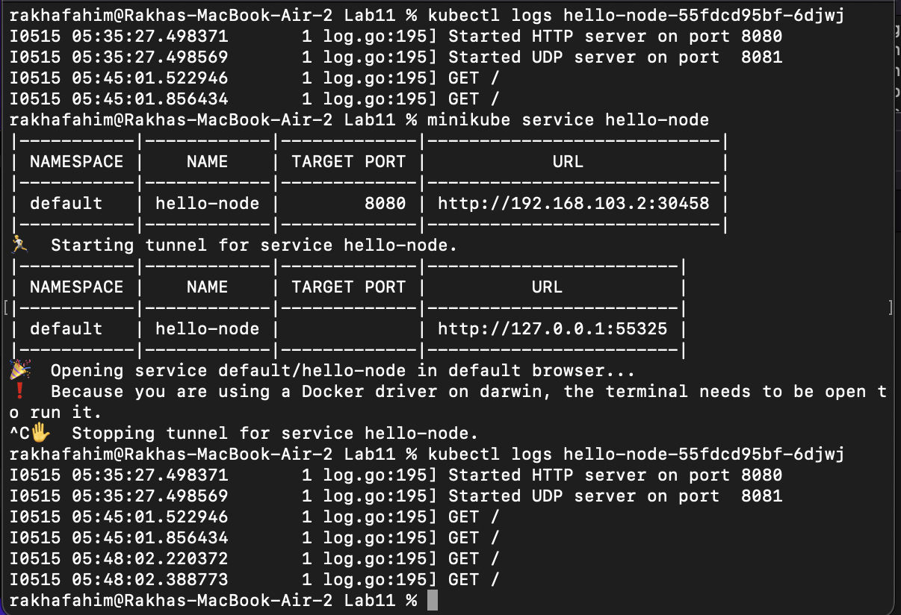
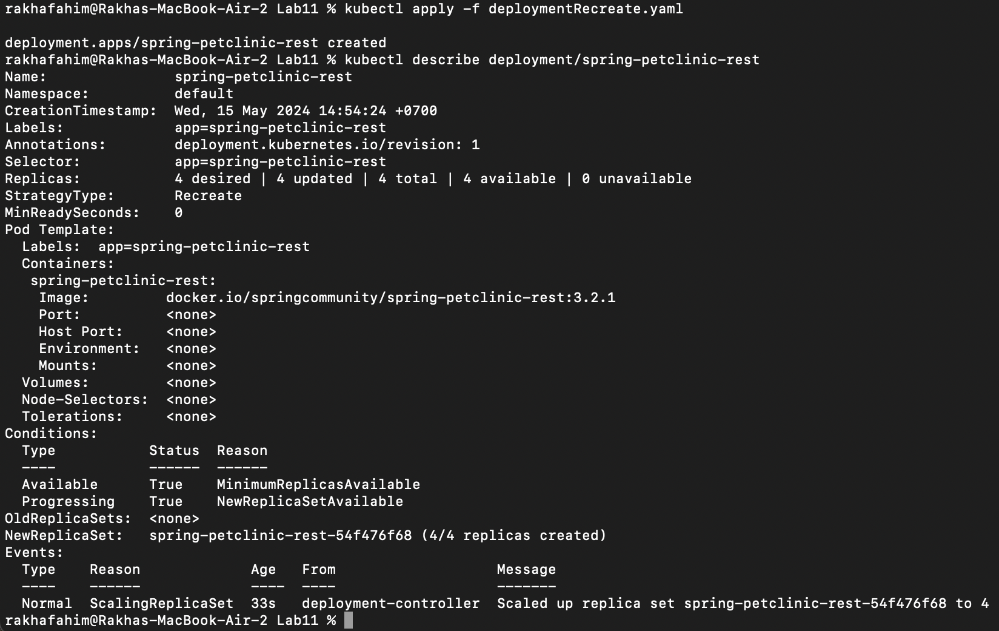

## Reflection 1

### 1. Compare the application logs before and after you exposed it as a Service. Try to open the app several times while the proxy into the Service is running. What do you see in the logs? Does the number of logs increase each time you open the app?

When you access the application through the proxy into the Service, each access should generate a log entry if the application logs such requests. Therefore, you would expect to see the number of log entries increase with each request you make to the application. The logs might show incoming traffic, the source of the requests such as HTTP GET in the screenshot, and other details depending on how verbose the logging is configured in the application.

### 2. Notice that there are two versions of kubectl get invocation during this tutorial section. The first does not have any option, while the latter has -n option with value set to kube-system. What is the purpose of the -n option and why did the output not list the pods/services that you explicitly created?
The -n option with kubectl get command is used to specify the namespace in which to look for resources. Namespaces in Kubernetes are used to organize resources in a cluster and can be thought of as a virtual cluster within a cluster. They help different teams or projects to use the same cluster without interfering with each other, by isolating their resources.

Why the output did not list the pods/services that you explicitly created:

If the resources (pods, services, etc.) you created are in a different namespace than kube-system, they will not appear when you run kubectl get with -n kube-system. The default namespace for resources is default unless specified otherwise during their creation.
When you use kubectl get without specifying -n, it defaults to the default namespace, or the namespace set in your Kubernetes context. Thus, it only lists resources in that specific namespace.

## Reflection 2
### 1. What is the difference between Rolling Update and Recreate deployment strategy?
- Rolling Update: This is the default strategy used by Kubernetes deployments. When you update a Deployment, it kills the old pods and creates new ones in a rolling fashion to ensure that no downtime occurs. It manages the transition of pods by gradually reducing the number of old replicas and increasing the number of new replicas, maintaining application availability throughout.

- Recreate: This strategy kills all the existing pods before any new ones are created. Unlike Rolling Update, Recreate strategy results in downtime during the deployment as there are moments when no instances of the application are running. However, it can be useful in scenarios where you cannot have two versions of the application running simultaneously.

### 2. Try deploying the Spring Petclinic REST using Recreate deployment strategy and document


### 3. Prepare different manifest files for executing Recreate deployment strategy.
```
    apiVersion: apps/v1
    kind: Deployment
    metadata:
    annotations:
    deployment.kubernetes.io/revision: "1"
    kubectl.kubernetes.io/last-applied-configuration: |
        {"apiVersion":"apps/v1","kind":"Deployment","metadata":{"annotations":{"deployment.kubernetes.io/revision":"4"},"creationTimestamp":"2024-05-14T06:34:29Z","generation":6,"labels":{"app":"spring-petclinic-rest"},"name":"spring-petclinic-rest","namespace":"default","resourceVersion":"5181","uid":"0e6e41f6-bf46-4d4f-a4ed-82f1ca59b27e"},"spec":{"progressDeadlineSeconds":600,"replicas":4,"revisionHistoryLimit":10,"selector":{"matchLabels":{"app":"spring-petclinic-rest"}},"strategy":{"type":"Recreate"},"template":{"metadata":{"creationTimestamp":null,"labels":{"app":"spring-petclinic-rest"}},"spec":{"containers":[{"image":"docker.io/springcommunity/spring-petclinic-rest:3.2.1","imagePullPolicy":"IfNotPresent","name":"spring-petclinic-rest","resources":{},"terminationMessagePath":"/dev/termination-log","terminationMessagePolicy":"File"}],"dnsPolicy":"ClusterFirst","restartPolicy":"Always","schedulerName":"default-scheduler","securityContext":{},"terminationGracePeriodSeconds":30}}},"status":{"conditions":[{"lastTransitionTime":"2024-05-14T06:34:29Z","lastUpdateTime":"2024-05-14T07:03:39Z","message":"ReplicaSet \"spring-petclinic-rest-54f476f68\" has successfully progressed.","reason":"NewReplicaSetAvailable","status":"True","type":"Progressing"},{"lastTransitionTime":"2024-05-14T07:14:04Z","lastUpdateTime":"2024-05-14T07:14:04Z","message":"Deployment does not have minimum availability.","reason":"MinimumReplicasUnavailable","status":"False","type":"Available"}],"observedGeneration":6,"replicas":4,"unavailableReplicas":4,"updatedReplicas":4}}
    creationTimestamp: "2024-05-14T12:57:25Z"
    generation: 1
    labels:
    app: spring-petclinic-rest
    name: spring-petclinic-rest
    namespace: default
    resourceVersion: "15734"
    uid: b7ddb571-2ea7-4511-a8b0-c2b7e5de196a
    spec:
    progressDeadlineSeconds: 600
    replicas: 4
    revisionHistoryLimit: 10
    selector:
    matchLabels:
        app: spring-petclinic-rest
    strategy:
    type: Recreate
    template:
    metadata:
        creationTimestamp: null
        labels:
        app: spring-petclinic-rest
    spec:
        containers:
        - image: docker.io/springcommunity/spring-petclinic-rest:3.2.1
        imagePullPolicy: IfNotPresent
        name: spring-petclinic-rest
        resources: {}
        terminationMessagePath: /dev/termination-log
        terminationMessagePolicy: File
        dnsPolicy: ClusterFirst
        restartPolicy: Always
        schedulerName: default-scheduler
        securityContext: {}
        terminationGracePeriodSeconds: 30
    status:
    conditions:
    - lastTransitionTime: "2024-05-14T12:57:25Z"
    lastUpdateTime: "2024-05-14T12:57:25Z"
    message: Deployment does not have minimum availability.
    reason: MinimumReplicasUnavailable
    status: "False"
    type: Available
    - lastTransitionTime: "2024-05-14T12:57:25Z"
    lastUpdateTime: "2024-05-14T12:57:26Z"
    message: ReplicaSet "spring-petclinic-rest-54f476f68" is progressing.
    reason: ReplicaSetUpdated
    status: "True"
    type: Progressing
    observedGeneration: 1
    replicas: 4
    unavailableReplicas: 4
    updatedReplicas: 4
```

### 4. What do you think are the benefits of using Kubernetes manifest files? 
- Consistency: Manifest files ensure that deployments are consistent, reproducible, and can be version controlled. This minimizes the human error that can occur with manual commands.
- Automation: Applying a manifest file (kubectl apply -f) can automate the deployment of not just the application but also the entire environment, including configurations, secrets, and network policies.
- Scalability: It’s easier to scale resources with manifest files since changes can be made directly in the file and reapplied.
- Documentation: Manifest files act as documentation of the current state of the deployment, which is essential for maintenance and understanding the deployment setup.